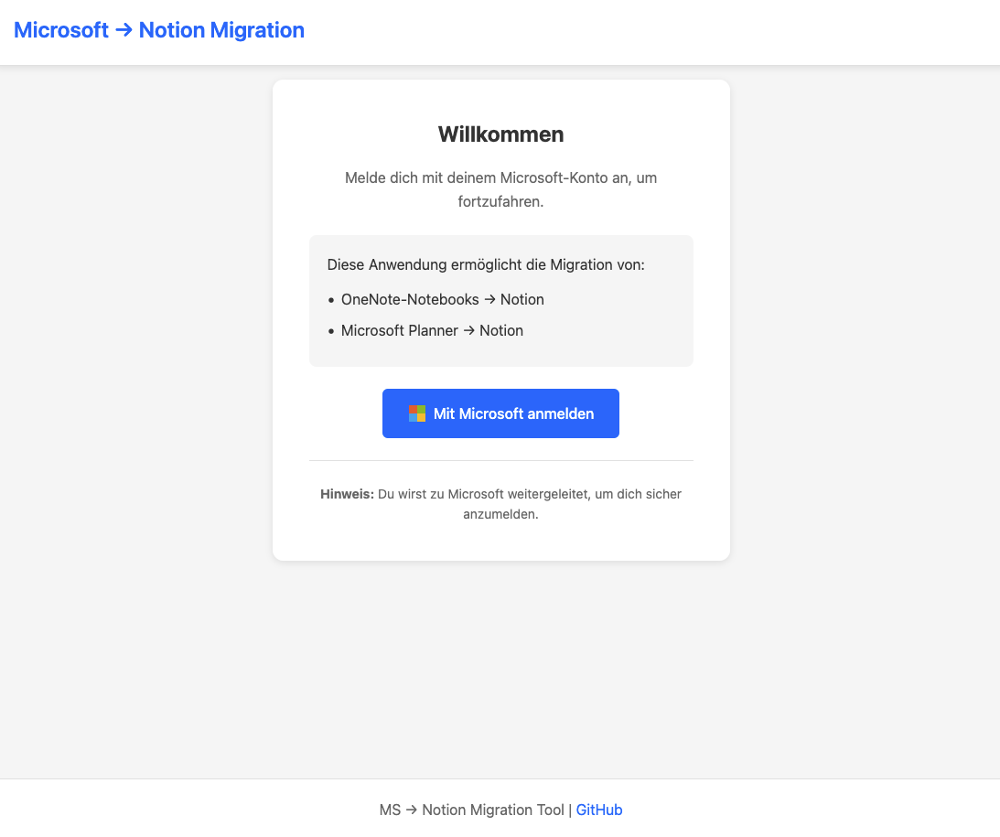
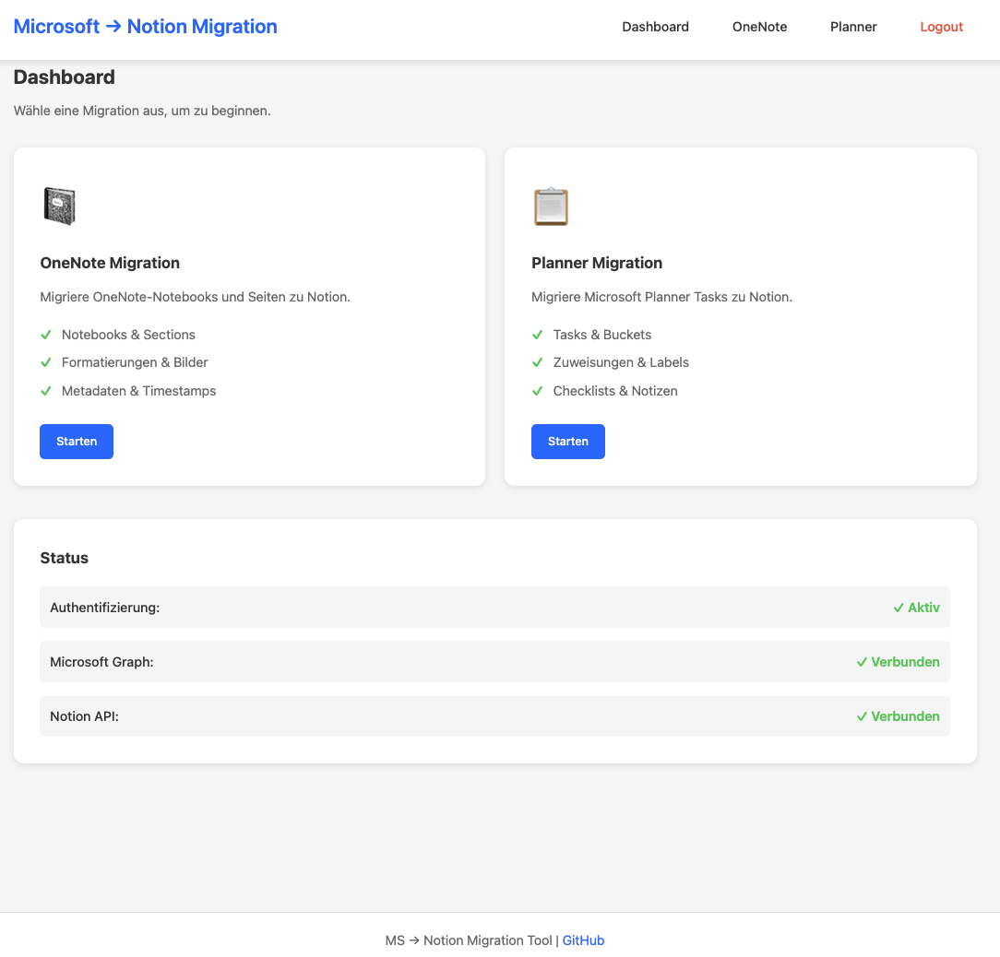
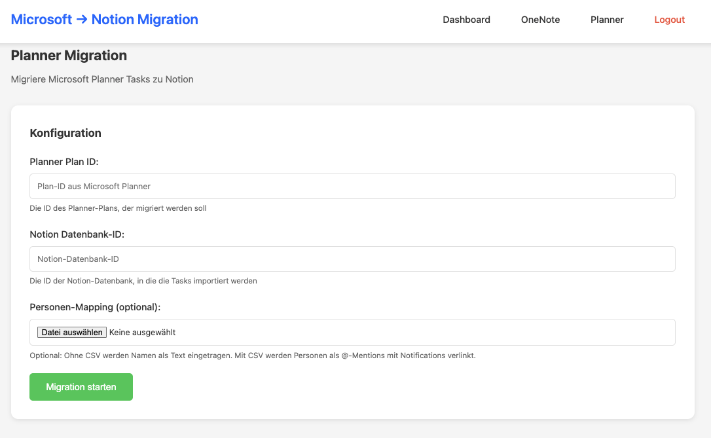

# 🌐 Web-GUI Dokumentation

Flask-basierte Weboberfläche für Microsoft → Notion Migration Tools.

---

## 📋 Übersicht

Die Web-GUI bietet eine benutzerfreundliche grafische Oberfläche für alle Migrations-Tools. Sie ist konzipiert für **Single-User-Nutzung** und läuft lokal auf Ihrem Computer.

### Features

- 🔐 **Microsoft OAuth-Authentifizierung** (Authorization Code Flow)
- 📓 **OneNote-Migration** mit grafischer Notebook-Auswahl
- 📋 **Planner-Migration** mit interaktiven Formularen
- 📊 **Live-Fortschrittsanzeige** während der Migration
- 🎨 **Responsive Design** für Desktop und Mobile
- ⚡ **Automatischer Token-Refresh** (MS Graph Tokens sind ~60-75 Min. gültig)

---

## 🚀 Quick Start

### Voraussetzungen

1. **Azure AD App Registration aktualisieren:**
   - Client Secret erstellen
   - Redirect URI hinzufügen: `http://localhost:8080/callback`
   - Web-Platform aktivieren

2. **.env konfigurieren:**
   ```bash
   MS_CLIENT_SECRET=ihr-client-secret
   FLASK_SECRET_KEY=$(python -c 'import secrets; print(secrets.token_hex(32))')
   FLASK_REDIRECT_URI=http://localhost:8080/callback
   FLASK_PORT=8080
   ```

3. **Dependencies installieren:**
   ```bash
   pip install -r requirements.txt
   ```

### Server starten

```bash
# Option 1: Im web-Verzeichnis
cd web
python app.py

# Option 2: Als Python-Modul
python -m web.app
```

Server läuft auf: **http://localhost:8080**

📖 **Vollständige Anleitung:** [web/QUICKSTART.md](../web/QUICKSTART.md)

---

## 🏗️ Architektur

### Komponenten

```
web/
├── app.py                  # Flask-Hauptanwendung
├── templates/              # Jinja2-Templates
│   ├── base.html          # Basis-Layout mit Navigation
│   ├── login.html         # Microsoft-Login
│   ├── dashboard.html     # Hauptseite
│   ├── error.html         # Fehlerseite
│   ├── onenote_dashboard.html
│   └── planner_dashboard.html
└── static/                 # Statische Assets
    ├── style.css          # CSS-Styling
    └── main.js            # JavaScript-Utilities
```

### Authentifizierungs-Flow

1. Benutzer ruft `/login` auf
2. Flask generiert Microsoft OAuth URL mit `state` Parameter
3. Benutzer wird zu Microsoft weitergeleitet
4. Nach erfolgreicher Anmeldung: Redirect zu `/callback?code=...`
5. Flask tauscht `code` gegen Access Token
6. Token wird in Flask-Session gespeichert
7. **Token-Refresh erfolgt automatisch** durch MSAL

### API-Endpoints

| Endpoint | Methode | Beschreibung |
|----------|---------|--------------|
| `/` | GET | Dashboard (erfordert Auth) |
| `/login` | GET | Microsoft Login initiieren |
| `/callback` | GET | OAuth-Callback |
| `/logout` | GET | Logout |
| `/onenote` | GET | OneNote-Dashboard |
| `/api/onenote/notebooks?site_url=...` | GET | Notebooks abrufen |
| `/api/onenote/migrate` | POST | Migration starten |
| `/planner` | GET | Planner-Dashboard |
| `/api/planner/migrate` | POST | Migration starten |

---

## 🔐 Authentifizierung

### CLI vs. Web

| Aspekt | CLI | Web-GUI |
|--------|-----|---------|
| **Flow** | Device Code Flow | Authorization Code Flow |
| **Token-Speicherung** | Lokale Datei (`~/.ms_notion_migration_token_cache.bin`) | Flask-Session (In-Memory) |
| **Benutzerfreundlichkeit** | Terminal-basiert | Browser-basiert |
| **Geeignet für** | Automatisierung, Skripting | Interaktive Nutzung |

### Token-Gültigkeit

**Microsoft Graph Access Token:**
- Gültigkeit: **60-75 Minuten**
- Automatischer Refresh durch MSAL ✅
- Refresh Token Gültigkeit: **90 Tage** (standardmäßig)

Die Web-GUI kümmert sich automatisch um Token-Refresh, sodass Sie während der Nutzung nicht neu authentifiziert werden müssen.

### Code-Implementierung

Die Web-Authentifizierung ist in `core/auth.py` implementiert:

```python
# Für CLI (Device Code Flow)
auth_manager.initialize(mode="cli")

# Für Web (Authorization Code Flow)
auth_manager.initialize(mode="web")
```

Die gleichen `core/ms_graph_client.py` und `core/notion_client.py` Module werden von beiden Modi verwendet.

---

## 🖥️ Benutzeroberfläche

### Login-Seite

- Microsoft-Logo und Anmelde-Button
- Informationen zu verfügbaren Migrations-Tools
- Weiterleitung zu Microsoft Login



### Dashboard

- Übersicht über verfügbare Migrations-Tools
- Status-Anzeige (Authentifizierung, API-Verbindungen)
- Navigation zu OneNote und Planner Migration



### OneNote-Migration

1. **SharePoint Site URL** eingeben
2. **Notebooks laden** (via API)
3. **Notebooks auswählen** (Checkbox-Liste)
4. **Notion-Ziel-Seiten-ID** eingeben
5. **Migration starten**
6. **Fortschritt beobachten** (Live-Updates)

### Planner-Migration

1. **Planner Plan ID** eingeben
2. **Notion-Datenbank-ID** eingeben
3. (Optional) **Personen-Mapping CSV** hochladen
4. **Migration starten**
5. **Fortschritt beobachten** (Live-Updates)



---

## 🔧 Konfiguration

### Umgebungsvariablen

```bash
# Microsoft Graph (auch für CLI benötigt)
MS_CLIENT_ID=...
MS_TENANT_ID=common
MS_GRAPH_SCOPES=Notes.Read.All,Sites.Read.All

# Microsoft Graph Web (NUR für Web-GUI)
MS_CLIENT_SECRET=...

# Notion (auch für CLI benötigt)
NOTION_TOKEN=...

# Flask Web-GUI (NUR für Web-GUI)
FLASK_SECRET_KEY=...
FLASK_REDIRECT_URI=http://localhost:8080/callback
FLASK_PORT=8080
FLASK_DEBUG=False  # True nur für Entwicklung
```

### Azure AD App Registration

**Erforderliche Konfiguration:**

1. **Authentication:**
   - Platform: **Web**
   - Redirect URI: `http://localhost:8080/callback`
   - Access tokens: ✅
   - ID tokens: ✅

2. **Certificates & secrets:**
   - Client Secret erstellen und in `.env` speichern

3. **API permissions:**
   - Microsoft Graph:
     - `Notes.Read.All` (Delegated)
     - `Sites.Read.All` (Delegated)

---

## 🚨 Troubleshooting

### Fehler: "No reply address is registered"

**Ursache:** Redirect URI nicht in Azure AD registriert

**Lösung:**
1. Azure Portal → App registrations → Ihre App
2. Authentication → Add a platform → Web
3. Redirect URI: `http://localhost:8080/callback` eintragen
4. Speichern

### Fehler: "MS_CLIENT_SECRET is required"

**Ursache:** Client Secret nicht in `.env` gesetzt

**Lösung:**
1. Azure Portal → Certificates & secrets → New client secret
2. Secret-Wert kopieren
3. In `.env` eintragen: `MS_CLIENT_SECRET=...`

### Fehler: "Port 5000 already in use"

**Ursache:** Port 5000 ist auf macOS von AirPlay Receiver belegt

**Lösung:** Port 8080 wird standardmäßig verwendet (bereits konfiguriert)

### Sessions funktionieren nicht

**Ursache:** Fehlender oder ungültiger Flask Secret Key

**Lösung:**
```bash
# Secret Key generieren
python -c 'import secrets; print(secrets.token_hex(32))'

# In .env eintragen
FLASK_SECRET_KEY=generierter-wert
```

### Import-Fehler: "Module 'flask' not found"

**Lösung:**
```bash
pip install -r requirements.txt
```

---

## 🌍 Deployment-Optionen

### Lokal (Standard)

**Für:** Persönliche Nutzung auf eigenem Computer

```bash
# .env
FLASK_REDIRECT_URI=http://localhost:8080/callback
FLASK_PORT=8080
```

**Zugriff:** Nur vom gleichen Computer

---

### Lokales Netzwerk

**Für:** Nutzung im Büro/Heimnetzwerk

```bash
# .env
FLASK_REDIRECT_URI=http://192.168.x.x:8080/callback
FLASK_PORT=8080
```

**Zugriff:** Alle Geräte im gleichen Netzwerk

⚠️ **Wichtig:** Bei IP-Änderung muss Redirect URI in Azure AD aktualisiert werden

---

### Öffentlich (Internet)

**Für:** Zugriff von überall

**Empfohlener Stack:**
- Domain mit HTTPS-Zertifikat (Let's Encrypt)
- Reverse Proxy (Nginx/Apache)
- Firewall & Rate Limiting
- Session-Store (Redis statt In-Memory)

**Hosting-Optionen:**
- Azure App Service
- AWS EC2 / Lightsail
- DigitalOcean Droplet
- Heroku

**Konfiguration:**
```bash
# .env
FLASK_REDIRECT_URI=https://ihre-domain.com/callback
FLASK_PORT=443  # HTTPS
```

⚠️ **Sicherheitshinweise:**
1. Immer HTTPS verwenden (niemals HTTP in Produktion!)
2. Starke Secret Keys generieren
3. `FLASK_DEBUG=False` in Produktion
4. Session-Backend auf Redis umstellen
5. Reverse Proxy mit SSL/TLS-Terminierung

---

## 🔒 Sicherheit

### Best Practices

1. **HTTPS in Produktion:**
   - Niemals HTTP für öffentliche Deployments
   - Let's Encrypt für kostenlose Zertifikate

2. **Secret Keys:**
   - Unterschiedliche Keys für Entwicklung und Produktion
   - Niemals in Git committen
   - Mindestens 32 Bytes zufällige Daten

3. **Environment-Variablen:**
   - `.env` in `.gitignore`
   - Produktions-Secrets in sicherer Umgebung (Azure Key Vault)

4. **Session-Management:**
   - Session-Timeout konfigurieren
   - Sichere Cookies (`Secure`, `HttpOnly`, `SameSite`)

5. **Rate Limiting:**
   - API-Requests limitieren
   - Flask-Limiter verwenden

---

## 🛠️ Entwicklung

### Development-Server starten

```bash
# Mit Debug-Modus
export FLASK_DEBUG=True
python web/app.py
```

### Code-Struktur erweitern

Die Web-GUI nutzt die bestehenden Core-Module:

```python
from core.auth import AuthManager  # CLI + Web
from core.ms_graph_client import MSGraphClient
from core.notion_client import NotionClient
```

**Neues Feature hinzufügen:**

1. Endpoint in `web/app.py` erstellen
2. Template in `web/templates/` erstellen
3. JavaScript in Template oder `web/static/main.js`
4. CSS in `web/static/style.css` ergänzen

---

## 📊 Bekannte Einschränkungen

- **Single-User:** Keine Multi-User-Verwaltung
- **In-Memory-Sessions:** Sessions gehen bei Server-Neustart verloren
- **Synchrone Verarbeitung:** Lange Migrationen blockieren Request
  - **Lösung für Produktion:** Celery/RQ für Background-Jobs

---

## 🗺️ Roadmap

Mögliche zukünftige Erweiterungen:

- [ ] Multi-User-Support mit User-Management
- [ ] Persistente Session-Storage (Redis)
- [ ] Background-Workers (Celery/RQ)
- [ ] WebSocket für Echtzeit-Updates
- [ ] Migration-Historie und Logging-Dashboard
- [ ] Automatische Token-Refresh-Benachrichtigungen
- [ ] Export von Migrations-Berichten (PDF/CSV)

---

## 📚 Weitere Ressourcen

- [Web-GUI README](../web/README.md) - Vollständige Anleitung
- [Quick Start Guide](../web/QUICKSTART.md) - 5-Minuten-Setup
- [OneNote Migration](ONENOTE.md) - CLI-Dokumentation
- [Planner Migration](PLANNER.md) - CLI-Dokumentation

---

## 🆘 Support

Bei Problemen oder Fragen:

1. Prüfen Sie die Troubleshooting-Sektion oben
2. Prüfen Sie die Azure AD Logs
3. Aktivieren Sie Debug-Logging: `FLASK_DEBUG=True`
4. Öffnen Sie ein GitHub Issue mit detaillierten Informationen

---

*Letzte Aktualisierung: Oktober 2025*
